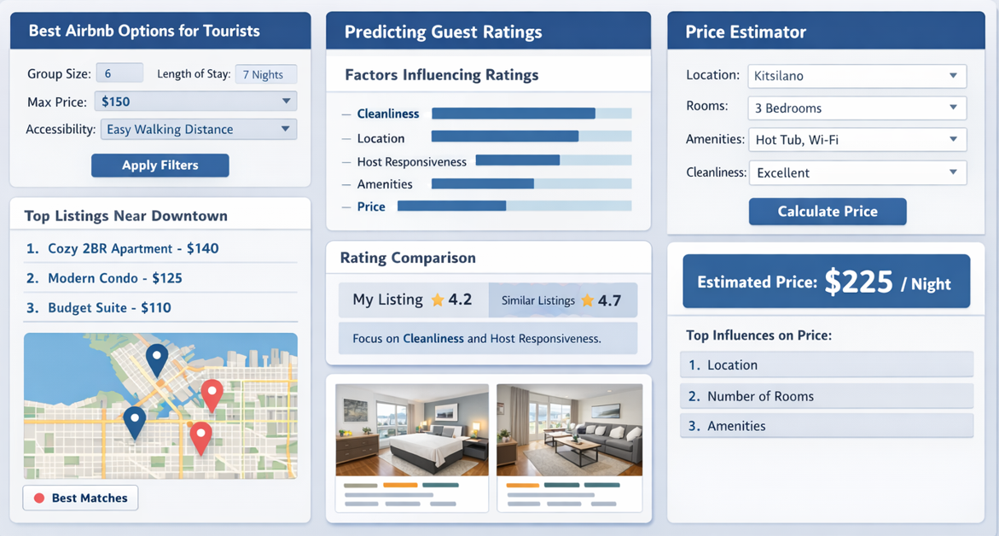

# Vancouver AirBnB Analyzer 
# DATA-551-Project-Group-6  
  
## Deployment
App is deployed at: https://vancouverairbnb-analyzer-data-551-project-group-6.fly.dev/  
  
## Run Dashboard  
From the root directory of the repository:
```
python src/app.py
```  
  
Then open:
- `http://127.0.0.1:8050`  
  
## App Overview  
The app presents a dashboard to the audience with various features, allowing them to interact with and customize the features of the dash to obtain results related to all 3 of our research questions. The results are displayed in a listings map and list (for RQ1 best tourist listings) or a predicted price and rating followed by most influential factors for each (for RQ2 and RQ3).  
  
For RQ1, the user is able to customize the filters under the "best Airbnb options for tourists" panel. After applying filters, the best matching Airbnb options (in a tourist setting) are listed in descending order of best match, with a map showing each one's location.  
  
For RQ2, the user is able to customize the predictor values under the "predicting guest ratings" panel to obtain a predicted rating for a prospective Airbnb. The predictors are also listed in order from greatest to least influence on ratings.  
  
For RQ3, the user is able to customize the predictor values under the "price estimator" panel to obtain an estimated price of prospective Airbnb. The predictors in the panel are also listed from greatest to least influence on price.  
  
The 3 columns (for each RQ) are independent of each other, and the behavior or customization (either through filters or predictors) of one does not affect another.  
  
## Dashboard Sketch
  
  
## Data
- `data/raw/listings.csv`

